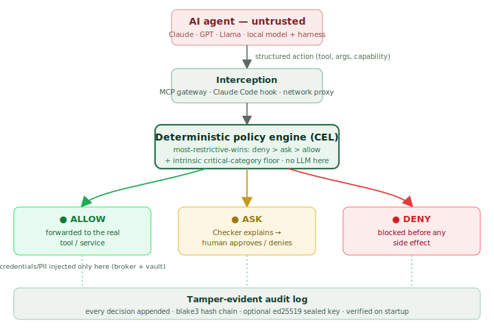
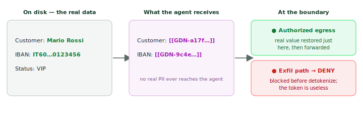
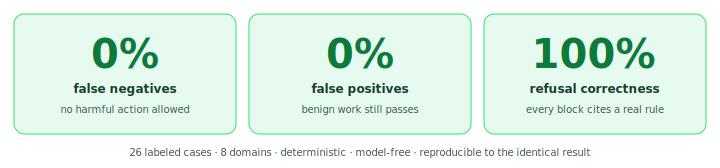
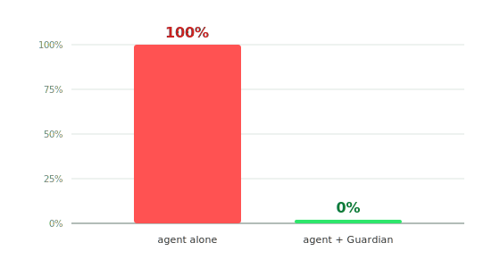

# Project Guardian
### A Deterministic, User-Space Action Firewall for Autonomous AI Agents

**Version 0.1.0 · June 2026 · License: Apache-2.0 · https://github.com/Vadale/project-guardian**

---

## Abstract

Autonomous AI agents are increasingly granted real capabilities — reading and writing
files, executing shell commands, making network requests, and acting on a user's behalf
in online services. The same property that makes them useful, non-deterministic
reasoning over untrusted input, also makes them manipulable: a prompt-injection payload
hidden in a web page, a file, or a tool result can redirect the agent toward harmful
actions. Any safeguard that depends on the agent's cooperation, or that inspects the
agent's own natural-language explanation of its intent, is therefore unsound by
construction.

**Guardian** is a local, user-space firewall that sits between an autonomous agent and
the resources it can affect. It intercepts every action as a *structured tool call* at
the agent's harness / tool / MCP boundary, evaluates it against a **deterministic policy
engine** that returns `allow`, `ask`, or `deny`, and records the decision to a
tamper-evident, hash-chained audit log. No language model is ever on the allow/deny
path; a separate "Checker" model is strictly advisory, translating a pending action into
plain language and scoring its risk for a human, and can never authorize anything.
Critical categories — moving money, accessing credentials, data exfiltration, and
irreversible deletion — can never silently resolve to `allow`, not even via a
third-party policy pack. Guardian is agent-agnostic, installs no kernel modules, and is
local-first. This paper describes its threat model, design principles, architecture, and
evaluation, and positions it against adjacent work in agent security.

---

## 1. The problem

The deployment pattern for agents has inverted the classic security assumption that the
programs we run are deterministic and trusted. An agent's control flow is decided at
runtime by a model conditioned on inputs an attacker may influence: the contents of a
file it reads, the text of a web page it fetches, the output of a tool it calls. This is
the **confused-deputy** problem in a new and acute form — the agent holds the user's
authority but can be tricked into exercising it for an attacker.

Two consequences follow, and they shape Guardian's entire design:

1. **The agent's words cannot be trusted.** Whatever the agent *says* it is about to do
   is attacker-controllable. A guardrail that reads the agent's explanation and decides
   from it can be talked out of its judgment. Only the *structured action* the agent
   actually emits — `write_file(path, bytes)`, `http_request(host, method, body)`,
   `transfer(amount, payee)` — is a faithful, non-negotiable description of the side
   effect.

2. **Enforcement must not itself be a model.** If the decision to permit or block were
   made by an LLM, that LLM would inherit the same manipulability. Enforcement has to be
   a deterministic function of the intercepted action and a human-authored policy.

Guardian is the embodiment of those two consequences.

---

## 2. Threat model

**Assets.** The user's files, shell, local processes, network egress, stored
credentials, money, and personal data; and the integrity of Guardian's own decision
record.

**Adversary.** A prompt-injection adversary who can influence the agent's inputs (and
therefore its proposed actions) but who does **not** have local code execution outside
the agent and does not control the user's operating system or Guardian's process. A
secondary adversary is a *misconfigured or malicious policy pack* distributed to users.

**Trust boundary.** Guardian trusts the user, the operating system, and its own
deterministic core. It does **not** trust the agent, the model driving it, the tool
results flowing back, or the natural-language rationale the agent produces.

**In scope.** Mediating every action that crosses the agent's tool / MCP boundary;
keeping credentials and designated sensitive values out of the agent; ensuring critical
categories cannot be silently allowed; producing a tamper-evident record; resisting the
agent's attempts to disable its own guardian.

**Explicitly out of scope (and stated honestly).** Guardian gates *actions*, not the
model's reasoning or output integrity — data the agent must reason over still enters its
context. A channel the agent uses that does **not** pass through a mediated boundary is
out of scope until a backstop (the network proxy or OS sandbox) catches it. Guardian is
not a content classifier, a model-alignment technique, or a substitute for the host
application's authentication and authorization.

---

## 3. Design principles (the hard invariants)

These are not aspirations; they are test-enforced gates in the codebase.

1. **No LLM on any allow/deny path.** Enforcement is the deterministic policy engine.
   The Checker translates and risk-scores only, and can never unlock.
2. **Evaluate structured actions, not the agent's prose.** The intercepted action is the
   ground truth; the agent's claims are manipulable.
3. **A small, dependency-acyclic, I/O-free core.** The action model and `Decision` type
   live in a crate with no I/O and no internal dependencies, so the security-critical
   boundary stays auditable.
4. **Critical categories are never auto-downgraded.** Money movement, credential access,
   data exfiltration, and irreversible deletion can never resolve to a silent `allow` —
   an *intrinsic floor* applied independently of any rule or pack.
5. **Fail closed on the critical path; fail open on convenience.** A timeout, a crash, or
   a malformed policy denies (or refuses to start); a missing desktop-notification helper
   is ignored.
6. **User-space only.** No kernel modules, no entitlement-gated OS hooks. OS sandboxing
   and the network proxy are off-the-shelf backstops, not the primary control.
7. **Tamper-evident audit.** Every decision is appended to a hash-chained log whose
   integrity is verified on startup.

A cross-cutting principle underlies all of these: **simplicity is a security feature.**
If a reviewer cannot quickly understand a decision path, that is a bug. Guardian is built
in Rust as a Cargo workspace of ten focused crates with `#![forbid(unsafe_code)]`
throughout.

---

## 4. Architecture

**Figure 1 —** How it works. Each agent action is intercepted as a structured call and resolved deterministically to allow / ask / deny; the advisory Checker and the human are reached only on *ask*; every decision is logged.

**Interception adapters.** The primary chokepoint is the **MCP gateway**: Guardian runs
as an MCP server the agent's client connects to, normalizing each tool call into a
structured `Action`. A **Claude Code `PreToolUse` hook** mediates that harness's native
tools, and a **TLS-intercepting forward proxy** (with an installed local CA) covers the
network path as a backstop for traffic that does not flow through a tool boundary. Each
adapter produces the same `Action` type, so the decision logic is transport-agnostic.

**Policy engine.** Rules are written in CEL (Common Expression Language) over the action
and a small evaluation environment (the user's home directory, the set of trusted hosts).
Evaluation is pure and deterministic, runs in microseconds, and resolves by
**most-restrictive-wins** (`deny` > `ask` > `allow`); any action not matched by a rule
falls to a restrictive default. Policies ship as signed packs and as human-readable TOML.

**The Checker (advisory only).** When — and *only* when — the policy returns `ask`, a
Checker model is invoked to render the pending action into a plain-language explanation
and a risk score for the human reviewer. By default this is an offline stub (a privacy
default); it can be pointed at a local HTTP model endpoint. It is architecturally
incapable of changing the decision.

**Approval cockpit.** A terminal UI shows pending `ask` actions with their explanation
and lets the user allow or deny, browse a tamper-evident activity history, manage broker
tokens and the data vault, and hit a kill switch. A best-effort desktop notification is
raised on each `ask` so the cockpit need not be watched.

**Audit log.** Every decision — allow, ask-resolved, or deny — is appended to a local,
append-only log chained with blake3, optionally signed with a per-install ed25519 key
held in the OS keychain. The chain is verified on startup; a broken or tampered chain
makes the daemon refuse to start (fail closed).

---

## 5. The enforcement model

A decision is a deterministic function of the structured action and the compiled policy,
with two overrides applied *before* the policy so a misconfiguration cannot weaken them:

- **Kill switch.** While a sentinel file exists next to the config, every action is
  denied. The agent cannot delete it (see self-protection).
- **Self-protection.** Writes or deletes targeting Guardian's own files (config, policy,
  audit, socket, the `.guardian` directory) are refused, with paths normalized so a
  relative or `..`-laden path cannot evade the check.

The policy then evaluates the action. On top of the policy result sits the
**intrinsic critical-category floor**: if the action's capability is one of money
movement, credential access, data exfiltration, or irreversible deletion, a result of
`allow` is raised to `ask`. This holds *regardless of what any rule or community pack
says* — a pack can tighten but never silently loosen a critical category. Signed packs
that attempt to widen a critical category are flagged at verification time and require an
explicit opt-in.

This is the concrete meaning of "deterministic enforcement, advisory intelligence": the
set of permitted actions is a property of code and policy that a reviewer can read and a
test can pin, never a property of a model's mood.

---

## 6. Keeping data out of the agent

Two complementary mechanisms minimize what the agent ever holds.

**Token broker.** Credentials for a target service live in the OS keychain, bound by
least-privilege caveats (expiry, allowed hosts, amount ceilings, fresh-approval
requirements for critical actions). The agent is given an opaque placeholder; on an
*allowed* outbound request, the broker injects the real credential. The agent never sees
the secret, so it cannot leak what it does not have.

**Data vault (tokenization).** Designated sensitive values — a name, an IBAN, a card
number — are replaced, before the agent ever sees them, with opaque random tokens of the
form `[[GDN-<128-bit-hex>]]`. The agent does its work on the tokens; the real values are
restored **only at an authorized egress** (an action the policy allows). A write to a
denied destination is blocked before any detokenization happens, so the token is useless
off-boundary. Detection of *carried* identifiers is deterministic (exact, case-insensitive
matching plus a Luhn card detector); fuzzy named-entity recognition over free text is
delegated to an optional sidecar (e.g. Microsoft Presidio) and is advisory — a miss falls
back to the deterministic secret-exfiltration deny rule. The scoping rule is deliberate:
tokenize identifiers the agent *carries*, not content it must *reason over*, because
over-redaction breaks the agent and under-redaction leaks.

**Figure 2 —** Impact on the agent: the data vault. The agent works entirely on opaque tokens; the real values are reconstructed only at an authorized egress, and the same token carried to a denied destination yields nothing.

This is a design decision (recorded as ADR-0005): Guardian owns the small,
security-critical, deterministic vault in Rust, and delegates the hard, fuzzy,
ML-heavy detection to an optional out-of-process sidecar rather than embedding a Python
model stack in the auditable core.

---

## 7. Evaluation

Measuring an action-firewall requires the right yardstick. The popular agent benchmarks
measure either task completion (did the agent finish the job) or *output integrity* (did
the agent's text echo an attacker payload). Neither isolates what a deterministic
action-firewall is responsible for: **given a structured intercepted action, does it
block the harmful ones, allow the benign ones, and cite a real rule when it blocks?**

**GuardianBench.** We built a benchmark for exactly this. It is deterministic,
model-free, offline, and re-runnable to the identical result by anyone. Across 26 labeled
cases spanning 8 domains (files, shell, finance, credentials, exfiltration, messaging,
memory, calendar), Guardian scores **0% false negatives** (no harmful action allowed),
**0% false positives** (no benign action hard-denied), and **100% refusal correctness**
(every block cites a real rule). Its redaction layer shows **0% PII leaks** and **0%
over-redaction** on its cases. A single false negative fails the suite with a non-zero
exit code, so it can gate continuous integration.

**Figure 3 —** GuardianBench scorecard. The middle chip is the "impact on the agent" guarantee: Guardian blocks the harmful actions without getting in the way of legitimate work.

**AgentDojo.** On the AgentDojo banking suite, with a local 12B-parameter agent, adding
Guardian takes the prompt-injection attack-success rate from **100% to 0%** — the
deterministic deny of money-movement holds regardless of how persuasive the injection is.
The effect is structural, not model-dependent. We report this with the honest caveat that
it is a local model chosen for reproducibility; frontier-model runs are future work.

**Figure 4 —** Impact on attacks. Prompt-injection attack-success rate on the AgentDojo banking suite, with a local 12B agent: **100% → 0%** once Guardian deterministically denies money-movement. (Local model for reproducibility; frontier-model runs are future work.)

**Honest scope of the numbers.** On benchmarks that score the *agent's output text*
(whether the model repeats a payload), Guardian appears neutral — because policing the
model's prose is out of scope for an action-firewall by design. We state this plainly
rather than claim a result the architecture does not produce.

---

## 8. Related work and positioning

**Guardrails / content classifiers** (NeMo Guardrails, Llama Guard, Lakera) primarily
inspect and filter the model's *input and output text*. Guardian is not a content filter:
it gates the *side effects* deterministically and logs them tamper-evidently, independent
of any model. The two are complementary — keep an output classifier, and put Guardian on
the actions.

**Credential brokers for agents** (Infisical Agent Vault, HashiCorp Vault dynamic
secrets) share Guardian's exact insight on secrets: a manipulable agent should hold a
placeholder, and a broker should inject the real credential on an authorized outbound
request. Guardian includes such a broker (and extends the placeholder idea to PII via the
data vault), but the broker is *one component* of a broader action firewall. A focused
broker is the right tool if all you need is to keep API keys out of a server-side agent;
Guardian is the right tool if you want to mediate and *prove* what an agent is allowed to
do across files, shell, network, and money, with a human in the loop and a tamper-evident
record. The approaches are concentric rather than competing.

**OS-level enforcement** (eBPF, kernel modules, seccomp/sandbox profiles) operates below
the semantic level where a meaningful decision can be made — it sees `write()` on a file
descriptor, not "transfer €4,800 to a new payee." Guardian makes the decision at the
action boundary where intent is legible, and uses an OS sandbox only as a backstop for
exec-class actions. It also avoids the deployment friction of kernel components and vendor
entitlements.

---

## 9. Limitations

We prefer to state these directly:

- **Scope ends at the mediated boundary.** A channel the agent uses that does not pass
  through a tool/MCP boundary is unmediated until the network proxy or OS sandbox catches
  it. The primary control is the boundary; the proxy and sandbox are defense-in-depth.
- **Reasoned-over data residual.** The vault minimizes carried identifiers, but content
  the agent must reason over still enters its context. Exfiltrating it still requires a
  channel Guardian gates, but Guardian does not police the model's reasoning.
- **Maturity.** This is v0.1.0 — a working MVP, not production-hardened. Release signing
  and notarization are deliberately off; Windows support is experimental and untested.
- **Evaluation breadth.** Headline efficacy numbers use a local model and our own
  deterministic benchmark; broader, frontier-model, third-party evaluation is future work.

---

## 10. Roadmap

Near-term work targets the gap between "works" and "effortless to adopt and trust":
signed and notarized cross-platform packaging; a one-command setup and pasteable client
configuration (shipped); desktop notifications for approvals (shipped); a richer set of
signed community policy packs; generalized MCP-proxy support for arbitrary upstreams; and
broader benchmarking, including frontier models and additional third-party suites. The
longer-term direction is a desktop application around the same daemon, so the human-in-
the-loop experience is available to non-technical users without a terminal.

---

## 11. Conclusion

The safety of an autonomous agent with real capabilities cannot rest on trusting the
agent. Guardian relocates trust to a place that deserves it: a small, deterministic,
auditable policy boundary, with intelligence kept strictly advisory and a tamper-evident
record of every decision. It treats the structured action as ground truth, refuses to let
critical categories slip through silently, and fails closed where it counts. The mechanism
is simple by design — and that simplicity is what lets a reviewer, or a careful user, trust
it. Guardian is open source under Apache-2.0; contributions and adversarial scrutiny of
the threat model are welcome.

---

## References

- Project Guardian — source, full specification, and threat model:
  <https://github.com/Vadale/project-guardian>
- GuardianBench — the action-firewall benchmark:
  `evaluation/guardianbench/` in the repository.
- ADR-0005 — privacy data handling (vault + tokenization + sidecar):
  `docs/adr/0005-privacy-data-handling.md`.
- AgentDojo — a dynamic benchmark for prompt-injection in agentic settings.
- Infisical Agent Vault — credential brokering for AI agents:
  <https://github.com/Infisical/agent-vault>.
- SANS — "Your AI Agent Is an Easily Confused Deputy: Why Cloud Security Needs a
  Credential Broker."
- Common Expression Language (CEL) — the policy expression language.

*Apache-2.0. This document is provided "as is", without warranty of any kind; the author
accepts no liability for use or misuse of the software it describes. See the repository's
LICENSE and SECURITY.md.*
